---
Sal Lempert

title: 'Psych 254 W15 PS #2'
author: "Mike Frank"
date: "February 4, 2015"
output: html_document
---

This is problem set #2, in which we hope you will practice the visualization package ggplot2, as well as hone your knowledge of the packages tidyr and dplyr. 

Part 1: Basic intro to ggplot
=============================

Part 1A: Exploring ggplot2 using qplot
--------------------------------------

Note, that this example is from the_grammar.R on http://had.co.nz/ggplot2 
I've adapted this for psych 254 purposes

First install and load the package.


```r
#install.packages("ggplot2")
library(ggplot2)
```

Now we're going to use qplot. qplot is the easy interface, meant to replace plot. You can give it simple `qplot(x,y)` examples, or slightly more complex examples like `qplot(x, y, col=grp, data=d)`. 

We're going to be using the diamonds dataset. This is a set of measurements of diamonds, along with their price etc.


```r
head(diamonds)
```

```
##   carat       cut color clarity depth table price    x    y    z
## 1  0.23     Ideal     E     SI2  61.5    55   326 3.95 3.98 2.43
## 2  0.21   Premium     E     SI1  59.8    61   326 3.89 3.84 2.31
## 3  0.23      Good     E     VS1  56.9    65   327 4.05 4.07 2.31
## 4  0.29   Premium     I     VS2  62.4    58   334 4.20 4.23 2.63
## 5  0.31      Good     J     SI2  63.3    58   335 4.34 4.35 2.75
## 6  0.24 Very Good     J    VVS2  62.8    57   336 3.94 3.96 2.48
```

```r
qplot(diamonds$carat, diamonds$price)
```

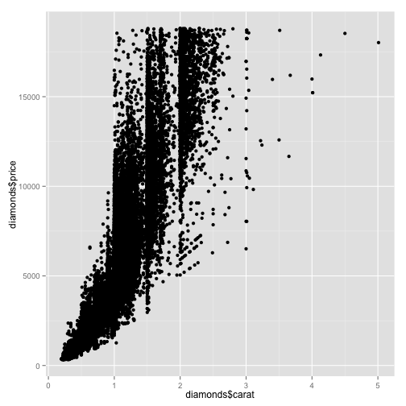 

Scatter plots are trivial, and easy to add features to. Modify this plot so that it uses the dataframe rather than working from variables in the general namespace (good to get away from retyping `diamonds$` every time you reference a variable). 


```r
d = diamonds
head(d)
```

```
##   carat       cut color clarity depth table price    x    y    z
## 1  0.23     Ideal     E     SI2  61.5    55   326 3.95 3.98 2.43
## 2  0.21   Premium     E     SI1  59.8    61   326 3.89 3.84 2.31
## 3  0.23      Good     E     VS1  56.9    65   327 4.05 4.07 2.31
## 4  0.29   Premium     I     VS2  62.4    58   334 4.20 4.23 2.63
## 5  0.31      Good     J     SI2  63.3    58   335 4.34 4.35 2.75
## 6  0.24 Very Good     J    VVS2  62.8    57   336 3.94 3.96 2.48
```

```r
qplot(d$carat, d$price)
```

 

Try adding clarity and cut, using shape and color as your visual variables. 


```r
qplot(d$carat, d$price, color = d$cut, shape = d$clarity)
```

```
## Warning: The shape palette can deal with a maximum of 6 discrete values
## because more than 6 becomes difficult to discriminate; you have 8.
## Consider specifying shapes manually. if you must have them.
```

```
## Warning: Removed 5445 rows containing missing values (geom_point).
```

```
## Warning: The shape palette can deal with a maximum of 6 discrete values
## because more than 6 becomes difficult to discriminate; you have 8.
## Consider specifying shapes manually. if you must have them.
```

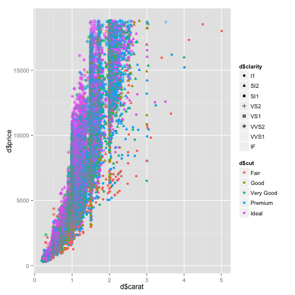 

One of the primary benefits of `ggplot2` is the use of facets - also known as small multiples in the Tufte vocabulary. That last plot was probably hard to read. Facets could make it better. Try adding a `facets = x ~ y` argument. `x ~ y` means row facets are by x, column facets by y. 


```r
qplot(carat, price, color = cut, shape = clarity, facets = cut ~ clarity, data = d)
```

```
## Warning: The shape palette can deal with a maximum of 6 discrete values
## because more than 6 becomes difficult to discriminate; you have 8.
## Consider specifying shapes manually. if you must have them.
```

```
## Warning: Removed 17 rows containing missing values (geom_point).
```

```
## Warning: Removed 9 rows containing missing values (geom_point).
```

```
## Warning: Removed 186 rows containing missing values (geom_point).
```

```
## Warning: Removed 71 rows containing missing values (geom_point).
```

```
## Warning: Removed 789 rows containing missing values (geom_point).
```

```
## Warning: Removed 268 rows containing missing values (geom_point).
```

```
## Warning: Removed 616 rows containing missing values (geom_point).
```

```
## Warning: Removed 230 rows containing missing values (geom_point).
```

```
## Warning: Removed 2047 rows containing missing values (geom_point).
```

```
## Warning: Removed 1212 rows containing missing values (geom_point).
```

```
## Warning: The shape palette can deal with a maximum of 6 discrete values
## because more than 6 becomes difficult to discriminate; you have 8.
## Consider specifying shapes manually. if you must have them.
```

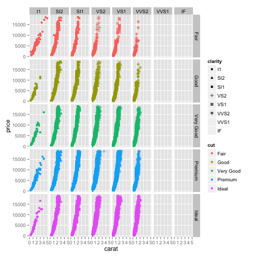 

But facets can also get overwhelming. Try to strike a good balance between color, shape, and faceting.

HINT: `facets = . ~ x` puts x on the columns, but `facets = ~ x` (no dot) *wraps* the facets. These are underlying calls to different functions, `facet_wrap` (no dot) and `facet_grid` (two arguments). 


```r
qplot(carat, price, color = cut, facets = cut~ clarity, data = d)
```

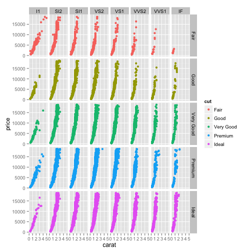 

The basic unit of a ggplot plot is a "geom" - a mapping between data (via an "aesthetic") and a particular geometric configuration on coordinate axes. 

Let's try some other geoms and manipulate their parameters. First, try a histogram (`geom="hist"`). 


```r
qplot(carat, geom = "histogram", color = cut, data = d)
```

```
## stat_bin: binwidth defaulted to range/30. Use 'binwidth = x' to adjust this.
```

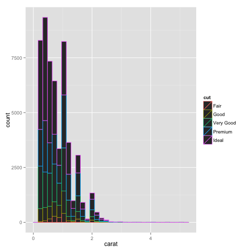 

```r
qplot(price, geom = "histogram", data = d)
```

```
## stat_bin: binwidth defaulted to range/30. Use 'binwidth = x' to adjust this.
```

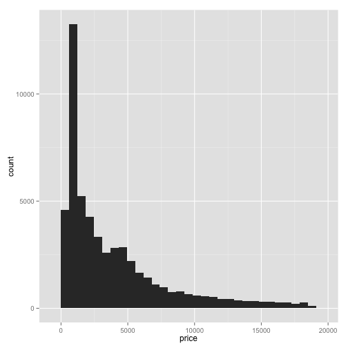 

Now facet your histogram by clarity and cut. 


```r
qplot(carat, geom = "histogram", color = cut, facets = cut~ clarity, data = d)
```

```
## stat_bin: binwidth defaulted to range/30. Use 'binwidth = x' to adjust this.
## stat_bin: binwidth defaulted to range/30. Use 'binwidth = x' to adjust this.
## stat_bin: binwidth defaulted to range/30. Use 'binwidth = x' to adjust this.
## stat_bin: binwidth defaulted to range/30. Use 'binwidth = x' to adjust this.
## stat_bin: binwidth defaulted to range/30. Use 'binwidth = x' to adjust this.
## stat_bin: binwidth defaulted to range/30. Use 'binwidth = x' to adjust this.
## stat_bin: binwidth defaulted to range/30. Use 'binwidth = x' to adjust this.
## stat_bin: binwidth defaulted to range/30. Use 'binwidth = x' to adjust this.
## stat_bin: binwidth defaulted to range/30. Use 'binwidth = x' to adjust this.
## stat_bin: binwidth defaulted to range/30. Use 'binwidth = x' to adjust this.
## stat_bin: binwidth defaulted to range/30. Use 'binwidth = x' to adjust this.
## stat_bin: binwidth defaulted to range/30. Use 'binwidth = x' to adjust this.
## stat_bin: binwidth defaulted to range/30. Use 'binwidth = x' to adjust this.
## stat_bin: binwidth defaulted to range/30. Use 'binwidth = x' to adjust this.
## stat_bin: binwidth defaulted to range/30. Use 'binwidth = x' to adjust this.
## stat_bin: binwidth defaulted to range/30. Use 'binwidth = x' to adjust this.
## stat_bin: binwidth defaulted to range/30. Use 'binwidth = x' to adjust this.
## stat_bin: binwidth defaulted to range/30. Use 'binwidth = x' to adjust this.
## stat_bin: binwidth defaulted to range/30. Use 'binwidth = x' to adjust this.
## stat_bin: binwidth defaulted to range/30. Use 'binwidth = x' to adjust this.
## stat_bin: binwidth defaulted to range/30. Use 'binwidth = x' to adjust this.
## stat_bin: binwidth defaulted to range/30. Use 'binwidth = x' to adjust this.
## stat_bin: binwidth defaulted to range/30. Use 'binwidth = x' to adjust this.
## stat_bin: binwidth defaulted to range/30. Use 'binwidth = x' to adjust this.
## stat_bin: binwidth defaulted to range/30. Use 'binwidth = x' to adjust this.
## stat_bin: binwidth defaulted to range/30. Use 'binwidth = x' to adjust this.
## stat_bin: binwidth defaulted to range/30. Use 'binwidth = x' to adjust this.
## stat_bin: binwidth defaulted to range/30. Use 'binwidth = x' to adjust this.
## stat_bin: binwidth defaulted to range/30. Use 'binwidth = x' to adjust this.
## stat_bin: binwidth defaulted to range/30. Use 'binwidth = x' to adjust this.
## stat_bin: binwidth defaulted to range/30. Use 'binwidth = x' to adjust this.
## stat_bin: binwidth defaulted to range/30. Use 'binwidth = x' to adjust this.
## stat_bin: binwidth defaulted to range/30. Use 'binwidth = x' to adjust this.
## stat_bin: binwidth defaulted to range/30. Use 'binwidth = x' to adjust this.
## stat_bin: binwidth defaulted to range/30. Use 'binwidth = x' to adjust this.
## stat_bin: binwidth defaulted to range/30. Use 'binwidth = x' to adjust this.
## stat_bin: binwidth defaulted to range/30. Use 'binwidth = x' to adjust this.
## stat_bin: binwidth defaulted to range/30. Use 'binwidth = x' to adjust this.
## stat_bin: binwidth defaulted to range/30. Use 'binwidth = x' to adjust this.
## stat_bin: binwidth defaulted to range/30. Use 'binwidth = x' to adjust this.
```

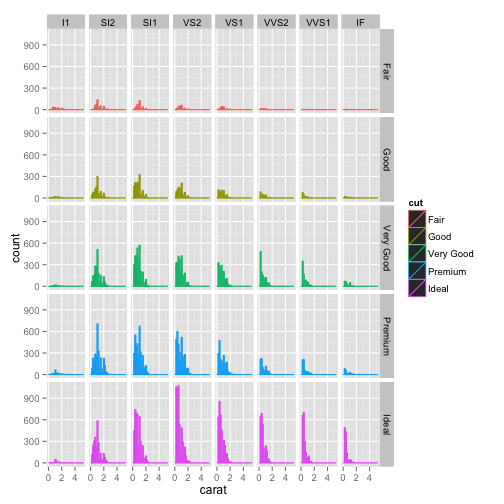 

```r
qplot(price, geom = "histogram", color = cut, facets = cut~ clarity, data = d)
```

```
## stat_bin: binwidth defaulted to range/30. Use 'binwidth = x' to adjust this.
## stat_bin: binwidth defaulted to range/30. Use 'binwidth = x' to adjust this.
## stat_bin: binwidth defaulted to range/30. Use 'binwidth = x' to adjust this.
## stat_bin: binwidth defaulted to range/30. Use 'binwidth = x' to adjust this.
## stat_bin: binwidth defaulted to range/30. Use 'binwidth = x' to adjust this.
## stat_bin: binwidth defaulted to range/30. Use 'binwidth = x' to adjust this.
## stat_bin: binwidth defaulted to range/30. Use 'binwidth = x' to adjust this.
## stat_bin: binwidth defaulted to range/30. Use 'binwidth = x' to adjust this.
## stat_bin: binwidth defaulted to range/30. Use 'binwidth = x' to adjust this.
## stat_bin: binwidth defaulted to range/30. Use 'binwidth = x' to adjust this.
## stat_bin: binwidth defaulted to range/30. Use 'binwidth = x' to adjust this.
## stat_bin: binwidth defaulted to range/30. Use 'binwidth = x' to adjust this.
## stat_bin: binwidth defaulted to range/30. Use 'binwidth = x' to adjust this.
## stat_bin: binwidth defaulted to range/30. Use 'binwidth = x' to adjust this.
## stat_bin: binwidth defaulted to range/30. Use 'binwidth = x' to adjust this.
## stat_bin: binwidth defaulted to range/30. Use 'binwidth = x' to adjust this.
## stat_bin: binwidth defaulted to range/30. Use 'binwidth = x' to adjust this.
## stat_bin: binwidth defaulted to range/30. Use 'binwidth = x' to adjust this.
## stat_bin: binwidth defaulted to range/30. Use 'binwidth = x' to adjust this.
## stat_bin: binwidth defaulted to range/30. Use 'binwidth = x' to adjust this.
## stat_bin: binwidth defaulted to range/30. Use 'binwidth = x' to adjust this.
## stat_bin: binwidth defaulted to range/30. Use 'binwidth = x' to adjust this.
## stat_bin: binwidth defaulted to range/30. Use 'binwidth = x' to adjust this.
## stat_bin: binwidth defaulted to range/30. Use 'binwidth = x' to adjust this.
## stat_bin: binwidth defaulted to range/30. Use 'binwidth = x' to adjust this.
## stat_bin: binwidth defaulted to range/30. Use 'binwidth = x' to adjust this.
## stat_bin: binwidth defaulted to range/30. Use 'binwidth = x' to adjust this.
## stat_bin: binwidth defaulted to range/30. Use 'binwidth = x' to adjust this.
## stat_bin: binwidth defaulted to range/30. Use 'binwidth = x' to adjust this.
## stat_bin: binwidth defaulted to range/30. Use 'binwidth = x' to adjust this.
## stat_bin: binwidth defaulted to range/30. Use 'binwidth = x' to adjust this.
## stat_bin: binwidth defaulted to range/30. Use 'binwidth = x' to adjust this.
## stat_bin: binwidth defaulted to range/30. Use 'binwidth = x' to adjust this.
## stat_bin: binwidth defaulted to range/30. Use 'binwidth = x' to adjust this.
## stat_bin: binwidth defaulted to range/30. Use 'binwidth = x' to adjust this.
## stat_bin: binwidth defaulted to range/30. Use 'binwidth = x' to adjust this.
## stat_bin: binwidth defaulted to range/30. Use 'binwidth = x' to adjust this.
## stat_bin: binwidth defaulted to range/30. Use 'binwidth = x' to adjust this.
## stat_bin: binwidth defaulted to range/30. Use 'binwidth = x' to adjust this.
## stat_bin: binwidth defaulted to range/30. Use 'binwidth = x' to adjust this.
```

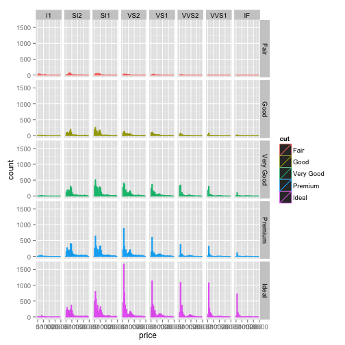 

I like a slightly cleaner look to my plots. Luckily, ggplot allows you to add "themes" to your plots. Try doing the same plot but adding `+ theme_bw()` or `+ theme_classic()`. Different themes work better for different applications, in my experience. 


```r
qplot(carat, geom = "histogram", facets = cut~ clarity, data = d)
```

```
## stat_bin: binwidth defaulted to range/30. Use 'binwidth = x' to adjust this.
## stat_bin: binwidth defaulted to range/30. Use 'binwidth = x' to adjust this.
## stat_bin: binwidth defaulted to range/30. Use 'binwidth = x' to adjust this.
## stat_bin: binwidth defaulted to range/30. Use 'binwidth = x' to adjust this.
## stat_bin: binwidth defaulted to range/30. Use 'binwidth = x' to adjust this.
## stat_bin: binwidth defaulted to range/30. Use 'binwidth = x' to adjust this.
## stat_bin: binwidth defaulted to range/30. Use 'binwidth = x' to adjust this.
## stat_bin: binwidth defaulted to range/30. Use 'binwidth = x' to adjust this.
## stat_bin: binwidth defaulted to range/30. Use 'binwidth = x' to adjust this.
## stat_bin: binwidth defaulted to range/30. Use 'binwidth = x' to adjust this.
## stat_bin: binwidth defaulted to range/30. Use 'binwidth = x' to adjust this.
## stat_bin: binwidth defaulted to range/30. Use 'binwidth = x' to adjust this.
## stat_bin: binwidth defaulted to range/30. Use 'binwidth = x' to adjust this.
## stat_bin: binwidth defaulted to range/30. Use 'binwidth = x' to adjust this.
## stat_bin: binwidth defaulted to range/30. Use 'binwidth = x' to adjust this.
## stat_bin: binwidth defaulted to range/30. Use 'binwidth = x' to adjust this.
## stat_bin: binwidth defaulted to range/30. Use 'binwidth = x' to adjust this.
## stat_bin: binwidth defaulted to range/30. Use 'binwidth = x' to adjust this.
## stat_bin: binwidth defaulted to range/30. Use 'binwidth = x' to adjust this.
## stat_bin: binwidth defaulted to range/30. Use 'binwidth = x' to adjust this.
## stat_bin: binwidth defaulted to range/30. Use 'binwidth = x' to adjust this.
## stat_bin: binwidth defaulted to range/30. Use 'binwidth = x' to adjust this.
## stat_bin: binwidth defaulted to range/30. Use 'binwidth = x' to adjust this.
## stat_bin: binwidth defaulted to range/30. Use 'binwidth = x' to adjust this.
## stat_bin: binwidth defaulted to range/30. Use 'binwidth = x' to adjust this.
## stat_bin: binwidth defaulted to range/30. Use 'binwidth = x' to adjust this.
## stat_bin: binwidth defaulted to range/30. Use 'binwidth = x' to adjust this.
## stat_bin: binwidth defaulted to range/30. Use 'binwidth = x' to adjust this.
## stat_bin: binwidth defaulted to range/30. Use 'binwidth = x' to adjust this.
## stat_bin: binwidth defaulted to range/30. Use 'binwidth = x' to adjust this.
## stat_bin: binwidth defaulted to range/30. Use 'binwidth = x' to adjust this.
## stat_bin: binwidth defaulted to range/30. Use 'binwidth = x' to adjust this.
## stat_bin: binwidth defaulted to range/30. Use 'binwidth = x' to adjust this.
## stat_bin: binwidth defaulted to range/30. Use 'binwidth = x' to adjust this.
## stat_bin: binwidth defaulted to range/30. Use 'binwidth = x' to adjust this.
## stat_bin: binwidth defaulted to range/30. Use 'binwidth = x' to adjust this.
## stat_bin: binwidth defaulted to range/30. Use 'binwidth = x' to adjust this.
## stat_bin: binwidth defaulted to range/30. Use 'binwidth = x' to adjust this.
## stat_bin: binwidth defaulted to range/30. Use 'binwidth = x' to adjust this.
## stat_bin: binwidth defaulted to range/30. Use 'binwidth = x' to adjust this.
```

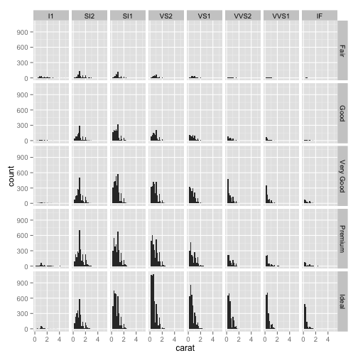 

```r
qplot(carat, geom = "histogram", facets = cut~ clarity, data = d) + theme_bw()
```

```
## stat_bin: binwidth defaulted to range/30. Use 'binwidth = x' to adjust this.
## stat_bin: binwidth defaulted to range/30. Use 'binwidth = x' to adjust this.
## stat_bin: binwidth defaulted to range/30. Use 'binwidth = x' to adjust this.
## stat_bin: binwidth defaulted to range/30. Use 'binwidth = x' to adjust this.
## stat_bin: binwidth defaulted to range/30. Use 'binwidth = x' to adjust this.
## stat_bin: binwidth defaulted to range/30. Use 'binwidth = x' to adjust this.
## stat_bin: binwidth defaulted to range/30. Use 'binwidth = x' to adjust this.
## stat_bin: binwidth defaulted to range/30. Use 'binwidth = x' to adjust this.
## stat_bin: binwidth defaulted to range/30. Use 'binwidth = x' to adjust this.
## stat_bin: binwidth defaulted to range/30. Use 'binwidth = x' to adjust this.
## stat_bin: binwidth defaulted to range/30. Use 'binwidth = x' to adjust this.
## stat_bin: binwidth defaulted to range/30. Use 'binwidth = x' to adjust this.
## stat_bin: binwidth defaulted to range/30. Use 'binwidth = x' to adjust this.
## stat_bin: binwidth defaulted to range/30. Use 'binwidth = x' to adjust this.
## stat_bin: binwidth defaulted to range/30. Use 'binwidth = x' to adjust this.
## stat_bin: binwidth defaulted to range/30. Use 'binwidth = x' to adjust this.
## stat_bin: binwidth defaulted to range/30. Use 'binwidth = x' to adjust this.
## stat_bin: binwidth defaulted to range/30. Use 'binwidth = x' to adjust this.
## stat_bin: binwidth defaulted to range/30. Use 'binwidth = x' to adjust this.
## stat_bin: binwidth defaulted to range/30. Use 'binwidth = x' to adjust this.
## stat_bin: binwidth defaulted to range/30. Use 'binwidth = x' to adjust this.
## stat_bin: binwidth defaulted to range/30. Use 'binwidth = x' to adjust this.
## stat_bin: binwidth defaulted to range/30. Use 'binwidth = x' to adjust this.
## stat_bin: binwidth defaulted to range/30. Use 'binwidth = x' to adjust this.
## stat_bin: binwidth defaulted to range/30. Use 'binwidth = x' to adjust this.
## stat_bin: binwidth defaulted to range/30. Use 'binwidth = x' to adjust this.
## stat_bin: binwidth defaulted to range/30. Use 'binwidth = x' to adjust this.
## stat_bin: binwidth defaulted to range/30. Use 'binwidth = x' to adjust this.
## stat_bin: binwidth defaulted to range/30. Use 'binwidth = x' to adjust this.
## stat_bin: binwidth defaulted to range/30. Use 'binwidth = x' to adjust this.
## stat_bin: binwidth defaulted to range/30. Use 'binwidth = x' to adjust this.
## stat_bin: binwidth defaulted to range/30. Use 'binwidth = x' to adjust this.
## stat_bin: binwidth defaulted to range/30. Use 'binwidth = x' to adjust this.
## stat_bin: binwidth defaulted to range/30. Use 'binwidth = x' to adjust this.
## stat_bin: binwidth defaulted to range/30. Use 'binwidth = x' to adjust this.
## stat_bin: binwidth defaulted to range/30. Use 'binwidth = x' to adjust this.
## stat_bin: binwidth defaulted to range/30. Use 'binwidth = x' to adjust this.
## stat_bin: binwidth defaulted to range/30. Use 'binwidth = x' to adjust this.
## stat_bin: binwidth defaulted to range/30. Use 'binwidth = x' to adjust this.
## stat_bin: binwidth defaulted to range/30. Use 'binwidth = x' to adjust this.
```

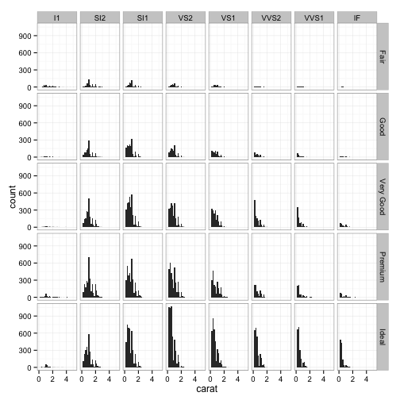 

```r
qplot(carat, geom = "histogram", facets = cut~ clarity, data = d) + theme_classic()
```

```
## stat_bin: binwidth defaulted to range/30. Use 'binwidth = x' to adjust this.
## stat_bin: binwidth defaulted to range/30. Use 'binwidth = x' to adjust this.
## stat_bin: binwidth defaulted to range/30. Use 'binwidth = x' to adjust this.
## stat_bin: binwidth defaulted to range/30. Use 'binwidth = x' to adjust this.
## stat_bin: binwidth defaulted to range/30. Use 'binwidth = x' to adjust this.
## stat_bin: binwidth defaulted to range/30. Use 'binwidth = x' to adjust this.
## stat_bin: binwidth defaulted to range/30. Use 'binwidth = x' to adjust this.
## stat_bin: binwidth defaulted to range/30. Use 'binwidth = x' to adjust this.
## stat_bin: binwidth defaulted to range/30. Use 'binwidth = x' to adjust this.
## stat_bin: binwidth defaulted to range/30. Use 'binwidth = x' to adjust this.
## stat_bin: binwidth defaulted to range/30. Use 'binwidth = x' to adjust this.
## stat_bin: binwidth defaulted to range/30. Use 'binwidth = x' to adjust this.
## stat_bin: binwidth defaulted to range/30. Use 'binwidth = x' to adjust this.
## stat_bin: binwidth defaulted to range/30. Use 'binwidth = x' to adjust this.
## stat_bin: binwidth defaulted to range/30. Use 'binwidth = x' to adjust this.
## stat_bin: binwidth defaulted to range/30. Use 'binwidth = x' to adjust this.
## stat_bin: binwidth defaulted to range/30. Use 'binwidth = x' to adjust this.
## stat_bin: binwidth defaulted to range/30. Use 'binwidth = x' to adjust this.
## stat_bin: binwidth defaulted to range/30. Use 'binwidth = x' to adjust this.
## stat_bin: binwidth defaulted to range/30. Use 'binwidth = x' to adjust this.
## stat_bin: binwidth defaulted to range/30. Use 'binwidth = x' to adjust this.
## stat_bin: binwidth defaulted to range/30. Use 'binwidth = x' to adjust this.
## stat_bin: binwidth defaulted to range/30. Use 'binwidth = x' to adjust this.
## stat_bin: binwidth defaulted to range/30. Use 'binwidth = x' to adjust this.
## stat_bin: binwidth defaulted to range/30. Use 'binwidth = x' to adjust this.
## stat_bin: binwidth defaulted to range/30. Use 'binwidth = x' to adjust this.
## stat_bin: binwidth defaulted to range/30. Use 'binwidth = x' to adjust this.
## stat_bin: binwidth defaulted to range/30. Use 'binwidth = x' to adjust this.
## stat_bin: binwidth defaulted to range/30. Use 'binwidth = x' to adjust this.
## stat_bin: binwidth defaulted to range/30. Use 'binwidth = x' to adjust this.
## stat_bin: binwidth defaulted to range/30. Use 'binwidth = x' to adjust this.
## stat_bin: binwidth defaulted to range/30. Use 'binwidth = x' to adjust this.
## stat_bin: binwidth defaulted to range/30. Use 'binwidth = x' to adjust this.
## stat_bin: binwidth defaulted to range/30. Use 'binwidth = x' to adjust this.
## stat_bin: binwidth defaulted to range/30. Use 'binwidth = x' to adjust this.
## stat_bin: binwidth defaulted to range/30. Use 'binwidth = x' to adjust this.
## stat_bin: binwidth defaulted to range/30. Use 'binwidth = x' to adjust this.
## stat_bin: binwidth defaulted to range/30. Use 'binwidth = x' to adjust this.
## stat_bin: binwidth defaulted to range/30. Use 'binwidth = x' to adjust this.
## stat_bin: binwidth defaulted to range/30. Use 'binwidth = x' to adjust this.
```

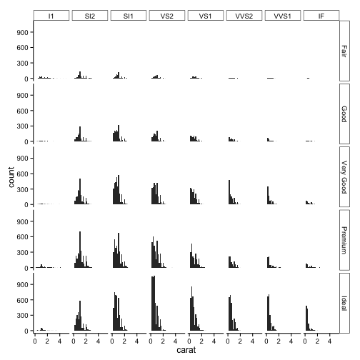 

Part 1B: Exploring ggplot2 using ggplot
---------------------------------------

`ggplot` is just a way of building `qplot` calls up more systematically. It's
sometimes easier to use and sometimes a bit more complicated. What I want to show off here is the functionality of being able to build up complex plots with multiple elements. You can actually do this using qplot pretty easily, but there are a few things that are hard to do. 

`ggplot` is the basic call, where you specify A) a dataframe and B) an aesthetic mapping from variables in the plot space to variables in the dataset. 


```r
d <- ggplot(diamonds, aes(x=carat, y=price)) # first you set the aesthetic and dataset
d + geom_point() # then you add geoms
```

 

```r
d + geom_point(aes(colour = carat)) # and you can keep doing this to add layers to the plot
```

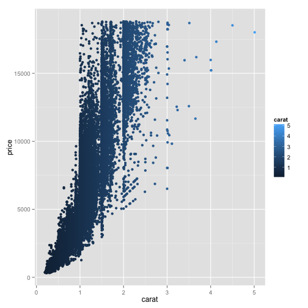 

Try writing this as a single set of additions (e.g. one line of R code, though you can put in linebreaks). This is the most common workflow for me. 


```r
ggplot(diamonds, aes(x=carat, y=price)) + geom_point() + geom_point(aes(colour=carat))
```

 


You can also set the aesthetic separately for each geom, and make some great plots this way. Though this can get complicated. Try using `ggplot` to build a histogram of prices. 


```r
ggplot(diamonds, aes(x=price)) + geom_histogram() + geom_histogram(aes(colour = cut))
```

```
## stat_bin: binwidth defaulted to range/30. Use 'binwidth = x' to adjust this.
## stat_bin: binwidth defaulted to range/30. Use 'binwidth = x' to adjust this.
```

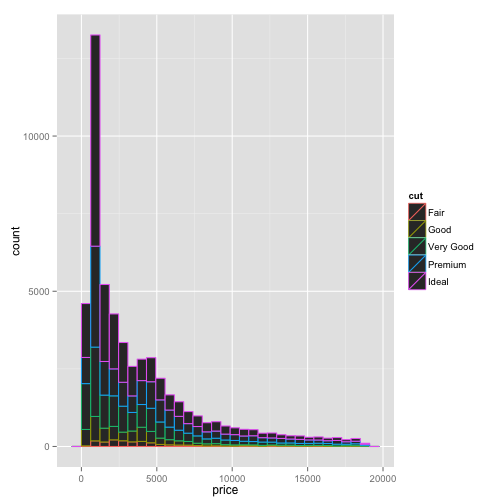 

Part 2: Diving into real data: Sklar et al. (2012)
==================================================

Sklar et al. (2012) claims evidence for unconscious arithmetic processing. We're going to do a reanalysis of their Experiment 6, which is the primary piece of evidence for that claim. The data are generously contributed by Asael Sklar. 

First let's set up a few preliminaries. 


```r
library(tidyr)
library(dplyr)
```

```
## 
## Attaching package: 'dplyr'
## 
## The following object is masked from 'package:stats':
## 
##     filter
## 
## The following objects are masked from 'package:base':
## 
##     intersect, setdiff, setequal, union
```

```r
library(stringr)

sem <- function(x) {sd(x) / sqrt(length(x))}
ci95 <- function(x) {sem(x) * 1.96}
```

Data Prep
---------

First read in two data files and subject info. A and B refer to different trial order counterbalances. 


```r
subinfo <- read.csv("../data/sklar_expt6_subinfo_corrected.csv")
d.a <- read.csv("../data/sklar_expt6a_corrected.csv")
d.b <- read.csv("../data/sklar_expt6b_corrected.csv")
```

Gather these datasets into long form and get rid of the Xs in the headers.


```r
d.a.tidy = gather(d.a, subjID, RT, X1:X21)
d.b.tidy = gather(d.b, subjID, RT, X22:X42)
```

Bind these together. Check out `bind_rows`.


```r
d.tidy = bind_rows(d.a.tidy, d.b.tidy)
```

```
## Warning in rbind_all(list(x, ...)): Unequal factor levels: coercing to
## character
```

```r
d.eventidier = d.tidy %>% mutate(subid = str_sub(subjID, start = 2))
d.eventidier = select(d.eventidier, 1:7, RT, subid)
```

Merge these with subject info. You will need to look into merge and its relatives, `left_join` and `right_join`. Call this dataframe `d`, by convention. 


```r
d.eventidier$subid = as.factor(d.eventidier$subid)
subinfo$subid = as.factor(subinfo$subid)
d = left_join(d.eventidier, subinfo)
```

```
## Joining by: "subid"
```

```
## Warning: joining factors with different levels, coercing to character
## vector
```

Clean up the factor structure.


```r
d$presentation.time <- factor(d$presentation.time)
levels(d$operand) <- c("addition","subtraction")
```

Data Analysis Preliminaries
---------------------------

Examine the basic properties of the dataset. First, take a histogram.


```r
d$RT = as.numeric(d$RT)
qplot(RT, data = d)
```

```
## stat_bin: binwidth defaulted to range/30. Use 'binwidth = x' to adjust this.
```

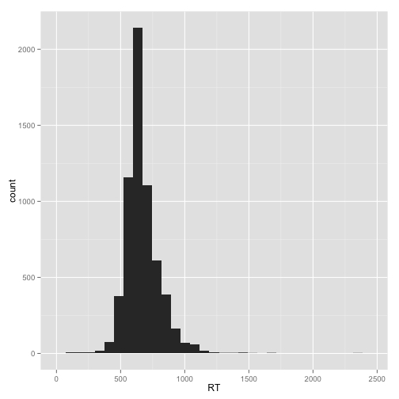 

```r
qplot(RT, presentation.time, data = d)
```

```
## Warning: Removed 237 rows containing missing values (geom_point).
```

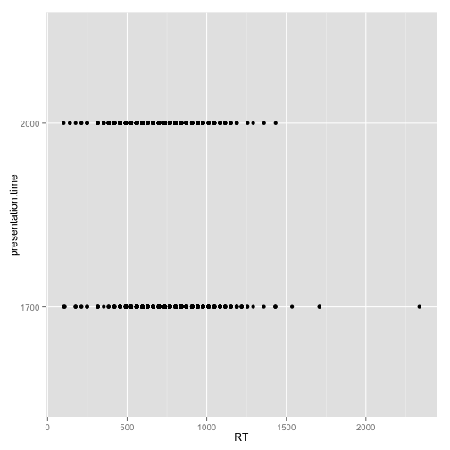 

Challenge question: what is the sample rate of the input device they are using to gather RTs?

30/second

```r
qplot(RT, bin = 1, data = d)
```

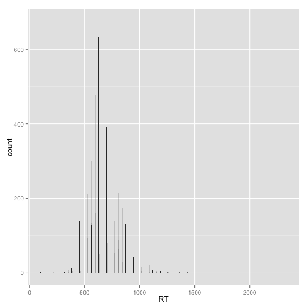 

Sklar et al. did two manipulation checks. Subjective - asking participants whether they saw the primes - and objective - asking them to report the parity of the primes (even or odd) to find out if they could actually read the primes when they tried. Examine both the unconscious and conscious manipulation checks (this information is stored in subinfo). What do you see? Are they related to one another?


```r
with(d, cor(subjective.test, objective.test))
```

```
## [1] 0.5786542
```

```r
with(d, qplot(subjective.test, objective.test))
```

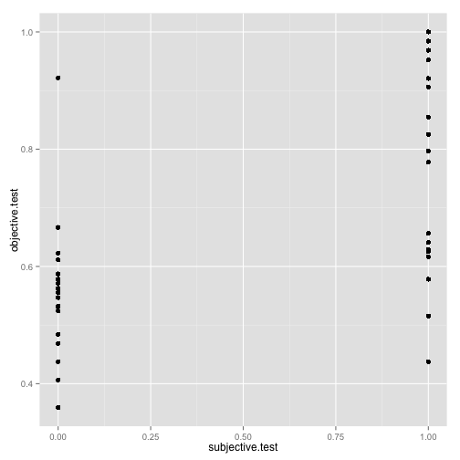 

```r
with(d, boxplot(subjective.test, objective.test))
```

 

The conscious and unconscious manipulation checks are related (r=0.57).  This seems to be borne out by the plots, which indicate that participants who said they did not see the prime were about at chance on the objective test, whereas those who said they did see the prime did better on the objective test.  

OK, let's turn back to the measure and implement Sklar et al.'s exclusion criterion. You need to have said you couldn't see (subjective test) and also be not significantly above chance on the objective test (< .6 correct). Call your new data frame `ds`.


```r
ds = filter(d, subjective.test ==0, objective.test<0.6)
#ds = filter(ds, is.na(RT) == FALSE) #also removing the NA's becuase they were messing things up
```

Sklar et al.'s analysis
-----------------------

Sklar et al. show a plot of a "facilitation effect" - the time to respond to incongruent primes minus the time to respond to congruent primes. They then show plot this difference score for the subtraction condition and for the two presentation times they tested. Try to reproduce this analysis.

HINT: first take averages within subjects, then compute your error bars across participants, using the `sem` function (defined above). 


```r
dev.off()
```

```
## null device 
##           1
```

```r
#qplot(congruent, RT, geom = "boxplot", facets = operand ~ presentation.time, na.rm = TRUE, data = ds) #ummm clearly not the right graph
#ds.sub = ds %>% group_by(subid, congruent)
#ds.sub.sum = summarise(ds.sub, mRT = mean(RT))
#ds %>% group_by(subid, congruent) %>% summarise(bet = mean(Answer_cost, na.rm=TRUE))
#ds.s = ds %>% group_by(subid) %>% mutate(subavg = mean(RT, na.rm = TRUE))

ds.s = ds %>% group_by(subid, congruent, presentation.time, operand) %>% mutate(rtavg = mean(RT, na.rm=TRUE))
#ds.s = ds.s %>% group_by(subid, operand) %>% summarise(rt.diff = identity(rtavg[congruent=="no"] - rtavg[congruent=="yes"]))
#ds.avg = ds.s %>% group_by(subid, operand) %>% do(rt.diff = .$rtavg[.$congruent=="no"] - .$rtavg[.$congruent=="yes"])
#ds.avg = ds.s %>% group_by(subid, operand) %>% mutate(rt.diff = filter(.$congruent =="no")$rtavg[[1]] - filter(.$congruent == "yes")$rtavg[[1]])
ds.avg = ds.s %>% group_by(subid, operand, presentation.time) %>% summarise(rt.diff = (rtavg[congruent =="no"]-rtavg[congruent=="yes"])[[1]])

ds.avg = ds.avg %>% group_by(presentation.time, operand) %>% mutate(sem = sem(rt.diff), n = n())

ds.f = ds.avg %>% group_by(presentation.time, operand) %>% summarise(rt = mean(rt.diff), sem = sem(rt.diff), n=n())

ds.new = ds %>% group_by(subid, congruent, presentation.time, operand) %>% summarise(rtavg = mean(RT, na.rm=TRUE)) %>% spread(congruent, rtavg) %>% mutate(rt.diff = no-yes) %>% group_by(presentation.time, operand) %>% summarise(avg.diff = mean(rt.diff), sem = sem(rt.diff), n=n()) #well, this way of doing things is much more elegant, but ultimately got me the same answer


#ummmm... doesn't look too different by condition... also why is it removing data??
#con_mean = ds %>% filter(congruent == "yes" %>% mean(.$RT)
#inc_mean = mean(filter(ds, congruent == "no")$RT)
```

Now plot this summary, giving more or less the bar plot that Sklar et al. gave (though I would keep operation as a variable here. Make sure you get some error bars on there (e.g. `geom_errorbar` or `geom_linerange`). 


```r
#ggplot(ds.f, aes(x = presentation.time, y=rt)) + geom_bar(stat = "identity")

qplot(x=presentation.time, y=rt, facets = .~operand, data = ds.f, geom="bar", stat="identity", position = "dodge", fill = presentation.time) + geom_errorbar(aes(ymin = rt-sem, ymax = rt+sem), width = 0.2) + xlab("Presentation Time") + ylab("[(avg RT in priming cond) − (avg RT in control cond)] (ms)") + ggtitle("Facilitation effect \nError bars denote SEM.")
```

```
## Warning in grid.Call(L_textBounds, as.graphicsAnnot(x$label), x$x, x$y, :
## conversion failure on '[(avg RT in priming cond) − (avg RT in control
## cond)] (ms)' in 'mbcsToSbcs': dot substituted for <e2>
```

```
## Warning in grid.Call(L_textBounds, as.graphicsAnnot(x$label), x$x, x$y, :
## conversion failure on '[(avg RT in priming cond) − (avg RT in control
## cond)] (ms)' in 'mbcsToSbcs': dot substituted for <88>
```

```
## Warning in grid.Call(L_textBounds, as.graphicsAnnot(x$label), x$x, x$y, :
## conversion failure on '[(avg RT in priming cond) − (avg RT in control
## cond)] (ms)' in 'mbcsToSbcs': dot substituted for <92>
```

```
## Warning in grid.Call(L_textBounds, as.graphicsAnnot(x$label), x$x, x$y, :
## conversion failure on '[(avg RT in priming cond) − (avg RT in control
## cond)] (ms)' in 'mbcsToSbcs': dot substituted for <e2>
```

```
## Warning in grid.Call(L_textBounds, as.graphicsAnnot(x$label), x$x, x$y, :
## conversion failure on '[(avg RT in priming cond) − (avg RT in control
## cond)] (ms)' in 'mbcsToSbcs': dot substituted for <88>
```

```
## Warning in grid.Call(L_textBounds, as.graphicsAnnot(x$label), x$x, x$y, :
## conversion failure on '[(avg RT in priming cond) − (avg RT in control
## cond)] (ms)' in 'mbcsToSbcs': dot substituted for <92>
```

```
## Warning in grid.Call.graphics(L_text, as.graphicsAnnot(x$label), x$x, x$y,
## : conversion failure on '[(avg RT in priming cond) − (avg RT in control
## cond)] (ms)' in 'mbcsToSbcs': dot substituted for <e2>
```

```
## Warning in grid.Call.graphics(L_text, as.graphicsAnnot(x$label), x$x, x$y,
## : conversion failure on '[(avg RT in priming cond) − (avg RT in control
## cond)] (ms)' in 'mbcsToSbcs': dot substituted for <88>
```

```
## Warning in grid.Call.graphics(L_text, as.graphicsAnnot(x$label), x$x, x$y,
## : conversion failure on '[(avg RT in priming cond) − (avg RT in control
## cond)] (ms)' in 'mbcsToSbcs': dot substituted for <92>
```

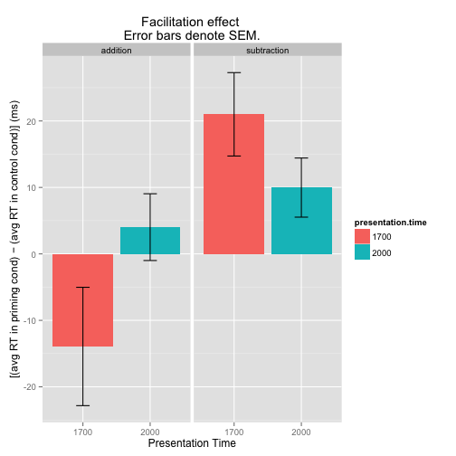 

```r
#qplot(operand, rt.diff, data = ds.avg)
#qplot(x=operand, y=rt.diff, geom = "bar", stat = "identity", position = "dodge", data = ds.avg)

#ggplot(ds.avg, aes(x = presentation.time, y=rt.diff)) + geom_bar(stat = "identity") + theme_grey()
```

What do you see here? How close is it to what Sklar et al. report? Do the error bars match? How do you interpret these data? 

Looks pretty similar, except their SEM error bars are about half as large as my SEM error bars.  

Challenge problem: verify Sklar et al.'s claim about the relationship between RT and the objective manipulation check.


Your own analysis
-----------------

Show us what you would do with these data, operating from first principles. What's the fairest plot showing a test of Sklar et al.'s original hypothesis that people can do arithmetic "non-consciously"?


Challenge problem: Do you find any statistical support for Sklar et al.'s findings?


