---
Sal Lempert

title: 'Psych 254 W15 PS #3'
author: "Mike Frank"
date: "February 22, 2015"
output: html_document
---

This is problem set #3, in which we want you to integrate your knowledge of data wrangling with some basic simulation skills and some linear modeling.


```r
library(dplyr)
```

```
## 
## Attaching package: 'dplyr'
## 
## The following object is masked from 'package:stats':
## 
##     filter
## 
## The following objects are masked from 'package:base':
## 
##     intersect, setdiff, setequal, union
```

```r
library(ggplot2)
```

Part 1: Basic simulation and NHST
=================================

Let's start by convincing ourselves that t-tests have the appropriate false positive rate. Run 10,000 t-tests with standard, normally-distributed data from a made up 30-person, single-measurement experiment (the command for sampling from a normal distribution is `rnorm`). What's the mean number of "significant" results?

First do this using a `for` loop.


```r
#dat = data.frame(x=numeric())

sig.count = 0;
for(i in 1:10000)
  {
  temp = rnorm(30)
  t.temp = t.test(temp)
  if(t.temp[3]<0.05)
    {
    sig.count = sig.count +1;
    }
  }
cat("Number of significant results: ", sig.count)
```

```
## Number of significant results:  462
```

```r
cat("False positive rate: ",sig.count/10000)
```

```
## False positive rate:  0.0462
```

485 significant results out of 10,000. False positive rate = 0.0485

Next, do this using the `replicate` function:


```r
dat = replicate(10000, t.test(rnorm(30))[[3]]<0.05)
summary(dat)
```

```
##    Mode   FALSE    TRUE    NA's 
## logical    9473     527       0
```

```r
cat("Number of significant results out of 10,000: ", summary(dat)[[3]])
```

```
## Number of significant results out of 10,000:  527
```

```r
cat("False positive rate: ", (as.numeric(summary(dat)[[3]])/10000))
```

```
## False positive rate:  0.0527
```
533 significant results out of 10,000.  False positive rate = 0.0533

Ok, that was a bit boring. Let's try something moderately more interesting - let's implement a p-value sniffing simulation, in the style of Simons, Nelson, & Simonsohn (2011).

Consider this scenario: you have done an experiment, again with 30 participants (one observation each, just for simplicity). The question is whether their performance is above chance. You aren't going to check the p-value every trial, but let's say you run 30 - then if the p-value is within the range p < .25 and p > .05, you optionally run 30 more and add those data, then test again. But if the original p value is < .05, you call it a day, and if the original is > .25, you also stop.  

First, write a function that implements this sampling regime.


```r
double.sample <- function () {
  temp = rnorm(30)
  ptemp = t.test(temp)[[3]]
  while(ptemp < 0.25 && ptemp > 0.05)
    {
      l = length(temp)
      b = l+1
      e = l+30
      temp[b:e] = rnorm(30)
      ptemp = t.test(temp)[[3]]
    }
ptemp
}
```

Now call this function 10k times and find out what happens. 


```r
dat = replicate(10000, double.sample()<0.05)
summary(dat)
```

```
##    Mode   FALSE    TRUE    NA's 
## logical    9104     896       0
```

```r
cat("Number of significant results out of 10,000: ", summary(dat)[[3]])
```

```
## Number of significant results out of 10,000:  896
```

```r
cat("False positive rate: ", (as.numeric(summary(dat)[[3]])/10000))
```

```
## False positive rate:  0.0896
```

Is there an inflation of false positives? How bad is it?

Yes there is an inflation of false positives!  Now the false positive rate is 0.0809

Now modify this code so that you can investigate this "double the sample" rule in a bit more depth. Let's see what happens when you double the sample ANY time p > .05 (not just when p < .25), or when you do it only if p < .5 or < .75. How do these choices affect the false positive rate?

HINT: Try to do this by making the function `double.sample` take the upper p value as an argument, so that you can pass this through dplyr.

huhh?

HINT 2: You may need more samples. Find out by looking at how the results change from run to run.


```r
double.sample.5 <- function () {
  temp = rnorm(30)
  ptemp = t.test(temp)[[3]]
  while(ptemp < 0.5 && ptemp > 0.05)
    {
      l = length(temp)
      b = l+1
      e = l+30
      temp[b:e] = rnorm(30)
      ptemp = t.test(temp)[[3]]
    }
ptemp
}
dat5 = replicate(10000, double.sample.5()<0.05)
summary(dat5)
```

```
##    Mode   FALSE    TRUE    NA's 
## logical    8783    1217       0
```

```r
cat("Number of significant results out of 10,000 using <0.5 rule: ", summary(dat5)[[3]])
```

```
## Number of significant results out of 10,000 using <0.5 rule:  1217
```

```r
cat("False positive rate: ", (as.numeric(summary(dat5)[[3]])/10000))
```

```
## False positive rate:  0.1217
```

```r
double.sample.75 <- function () {
  temp = rnorm(30)
  ptemp = t.test(temp)[[3]]
  while(ptemp < 0.75 && ptemp > 0.05)
    {
      l = length(temp)
      b = l+1
      e = l+30
      temp[b:e] = rnorm(30)
      ptemp = t.test(temp)[[3]]
    }
ptemp
}

dat75 = replicate(10000, double.sample.75()<0.05)
summary(dat75)
```

```
##    Mode   FALSE    TRUE    NA's 
## logical    8161    1839       0
```

```r
cat("Number of significant results out of 10,000 with continuation at 0.05<p<0.75: ", summary(dat75)[[3]])
```

```
## Number of significant results out of 10,000 with continuation at 0.05<p<0.75:  1839
```

```r
cat("False positive rate: ", (as.numeric(summary(dat75)[[3]])/10000))
```

```
## False positive rate:  0.1839
```

```r
double.sample.07 <- function () {
  temp = rnorm(30)
  ptemp = t.test(temp)[[3]]
  while(ptemp < 0.07 && ptemp > 0.05)
    {
      l = length(temp)
      b = l+1
      e = l+30
      temp[b:e] = rnorm(30)
      ptemp = t.test(temp)[[3]]
    }
ptemp
}

dat07 = replicate(10000, double.sample.07()<0.05)
summary(dat07)
```

```
##    Mode   FALSE    TRUE    NA's 
## logical    9454     546       0
```

```r
cat("Number of significant results out of 10,000 with continuation for 0.05<p<0.07: ", summary(dat07)[[3]])
```

```
## Number of significant results out of 10,000 with continuation for 0.05<p<0.07:  546
```

```r
cat("False positive rate: ", (as.numeric(summary(dat07)[[3]])/10000))
```

```
## False positive rate:  0.0546
```
With the continue rule at 0.05<p<0.5, the false positive rate is 0.1198.  With the continue rule at 0.05<p<0.75, the false positive rate is 0.1786.  I didn't run it with the p>0.05 rule because that seemed like a recipe for disaster (either it would crash my computer or give a 100% false positive rate).

What do you conclude on the basis of this simulation? How bad is this kind of data-dependent policy?

The more broad your contingent continuation rule is, the more false positives you get (ie you inflate some when you use a p<0.25 continuation rule, more at p<0.5, and even more at p<0.75).  For example, with the continuation rule at 0.05<p<0.07 the false positive rate is not inflated to a particularly large extent (false positive rate = 0.0512), but with the continuation rule at 0.05<p<0.75 the false positive rate is enormously inflated (false positive rate = 0.1786)


Part 2: The Linear Model
========================

2A: Basic Linear Modeling
-------------------------

Let's use the `ToothGrowth` dataset, on guineapig teeth based on orange juice
and vitamin C. This is super simple. (Try `?ToothGrowth`).

First plot the data, we'll use `qplot` to understand how `len` (tooth length) depends on `dose` (amount of Vitamin C) and `supp` (delivery method).


```r
dev.off()
```

```
## null device 
##           1
```

```r
#qplot(dose, len, colour = supp, data = ToothGrowth)
qplot(dose, len, geom = "boxplot", facets = . ~supp, data = ToothGrowth)
```

So now you see what's going on. 

Next, always make a histogram of the DV before making a linear model! This reveals the distribution and can be helpful in choosing your model type.


```r
hist(ToothGrowth$len)
```

 

```r
qplot(len, geom = "histogram", facets = dose ~supp, data = ToothGrowth)
```

```
## stat_bin: binwidth defaulted to range/30. Use 'binwidth = x' to adjust this.
## stat_bin: binwidth defaulted to range/30. Use 'binwidth = x' to adjust this.
## stat_bin: binwidth defaulted to range/30. Use 'binwidth = x' to adjust this.
## stat_bin: binwidth defaulted to range/30. Use 'binwidth = x' to adjust this.
## stat_bin: binwidth defaulted to range/30. Use 'binwidth = x' to adjust this.
## stat_bin: binwidth defaulted to range/30. Use 'binwidth = x' to adjust this.
```

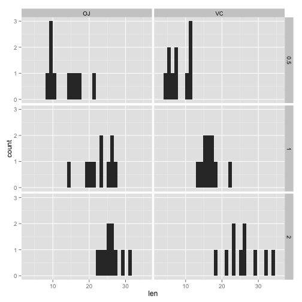 
well. erm. shit looks kinda weird and not normal, so. eh. 

Now make a linear model of tooth lengths using `lm`. Try making one with main effects and interactions and another with just main  effects. Make sure to assign them to variables so that you can get them later.


```r
mod.main = with(ToothGrowth, lm(len~dose + supp))
mod.int = with(ToothGrowth, lm(len~dose*supp))
summary(mod.main)
```

```
## 
## Call:
## lm(formula = len ~ dose + supp)
## 
## Residuals:
##    Min     1Q Median     3Q    Max 
## -6.600 -3.700  0.373  2.116  8.800 
## 
## Coefficients:
##             Estimate Std. Error t value Pr(>|t|)    
## (Intercept)   9.2725     1.2824   7.231 1.31e-09 ***
## dose          9.7636     0.8768  11.135 6.31e-16 ***
## suppVC       -3.7000     1.0936  -3.383   0.0013 ** 
## ---
## Signif. codes:  0 '***' 0.001 '**' 0.01 '*' 0.05 '.' 0.1 ' ' 1
## 
## Residual standard error: 4.236 on 57 degrees of freedom
## Multiple R-squared:  0.7038,	Adjusted R-squared:  0.6934 
## F-statistic: 67.72 on 2 and 57 DF,  p-value: 8.716e-16
```

```r
summary(mod.int)
```

```
## 
## Call:
## lm(formula = len ~ dose * supp)
## 
## Residuals:
##     Min      1Q  Median      3Q     Max 
## -8.2264 -2.8462  0.0504  2.2893  7.9386 
## 
## Coefficients:
##             Estimate Std. Error t value Pr(>|t|)    
## (Intercept)   11.550      1.581   7.304 1.09e-09 ***
## dose           7.811      1.195   6.534 2.03e-08 ***
## suppVC        -8.255      2.236  -3.691 0.000507 ***
## dose:suppVC    3.904      1.691   2.309 0.024631 *  
## ---
## Signif. codes:  0 '***' 0.001 '**' 0.01 '*' 0.05 '.' 0.1 ' ' 1
## 
## Residual standard error: 4.083 on 56 degrees of freedom
## Multiple R-squared:  0.7296,	Adjusted R-squared:  0.7151 
## F-statistic: 50.36 on 3 and 56 DF,  p-value: 6.521e-16
```

Now try taking out the intercept, using a -1 term in the formula. what does this do?


```r
mod.main.0 = with(ToothGrowth, lm(len~ -1 + dose + supp))
mod.int.0 = with(ToothGrowth, lm(len~-1 + dose*supp))
summary(mod.main.0)
```

```
## 
## Call:
## lm(formula = len ~ -1 + dose + supp)
## 
## Residuals:
##    Min     1Q Median     3Q    Max 
## -6.600 -3.700  0.373  2.116  8.800 
## 
## Coefficients:
##        Estimate Std. Error t value Pr(>|t|)    
## dose     9.7636     0.8768  11.135 6.31e-16 ***
## suppOJ   9.2725     1.2824   7.231 1.31e-09 ***
## suppVC   5.5725     1.2824   4.345 5.79e-05 ***
## ---
## Signif. codes:  0 '***' 0.001 '**' 0.01 '*' 0.05 '.' 0.1 ' ' 1
## 
## Residual standard error: 4.236 on 57 degrees of freedom
## Multiple R-squared:  0.9586,	Adjusted R-squared:  0.9564 
## F-statistic: 439.7 on 3 and 57 DF,  p-value: < 2.2e-16
```

```r
summary(mod.int.0)
```

```
## 
## Call:
## lm(formula = len ~ -1 + dose * supp)
## 
## Residuals:
##     Min      1Q  Median      3Q     Max 
## -8.2264 -2.8463  0.0504  2.2893  7.9386 
## 
## Coefficients:
##             Estimate Std. Error t value Pr(>|t|)    
## dose           7.811      1.195   6.534 2.03e-08 ***
## suppOJ        11.550      1.581   7.304 1.09e-09 ***
## suppVC         3.295      1.581   2.084   0.0418 *  
## dose:suppVC    3.904      1.691   2.309   0.0246 *  
## ---
## Signif. codes:  0 '***' 0.001 '**' 0.01 '*' 0.05 '.' 0.1 ' ' 1
## 
## Residual standard error: 4.083 on 56 degrees of freedom
## Multiple R-squared:  0.9622,	Adjusted R-squared:  0.9595 
## F-statistic: 356.2 on 4 and 56 DF,  p-value: < 2.2e-16
```

```r
anova(mod.main, mod.int) #significant
```

```
## Analysis of Variance Table
## 
## Model 1: len ~ dose + supp
## Model 2: len ~ dose * supp
##   Res.Df     RSS Df Sum of Sq      F  Pr(>F)  
## 1     57 1022.56                              
## 2     56  933.63  1     88.92 5.3335 0.02463 *
## ---
## Signif. codes:  0 '***' 0.001 '**' 0.01 '*' 0.05 '.' 0.1 ' ' 1
```

```r
#with(ToothGrowth, plot(len ~ dose, col = supp))
#abline(mod.main)
#grid.oj <- with(ToothGrowth, expand.grid(
#  supp = "oj", dose = as.numeric(levels(factor(dose)))
#))
#grid.vc <- with(ToothGrowth, expand.grid(
#  supp = "vc", dose = as.numeric(levels(factor(dose)))
#))

grid <- with(ToothGrowth, expand.grid(
  supp = levels(supp), dose = as.numeric(levels(factor(dose)))
))

#grid.oj$len <- stats::predict(mod.main, newdata=grid.oj)
#grid.vc$len <- stats::predict(mod.main, newdata=grid.vc)


#linedat = data.frame(oj = predict (mod.main, newdata = preds.oj), vc = predict (mod.main, newdata = preds.vc))

#plot with lines from the additive model with intercept
grid$len <- stats::predict(mod.main, newdata=grid)
ggplot(data = ToothGrowth, aes(x=dose, y=len)) + geom_point() + geom_point(aes(colour=supp)) + geom_line(data= filter(grid, supp == "OJ"), aes(color = supp))+ geom_line(data= filter(grid, supp == "VC"), aes(color = supp)) + ggtitle("Additive model with intercept")
```

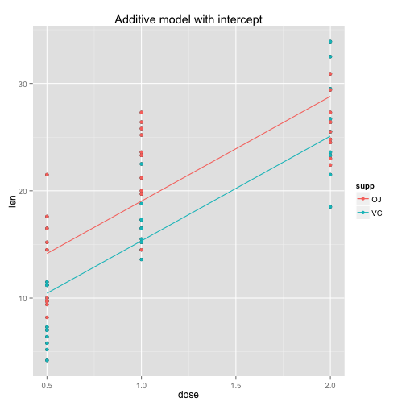 

```r
#plot with lines from additive model without intercept
grid$len <- stats::predict(mod.main.0, newdata=grid)
ggplot(data = ToothGrowth, aes(x=dose, y=len)) + geom_point() + geom_point(aes(colour=supp)) + geom_line(data= filter(grid, supp == "OJ"), aes(color = supp))+ geom_line(data= filter(grid, supp == "VC"), aes(color = supp)) + ggtitle("Additive model without intercept")
```

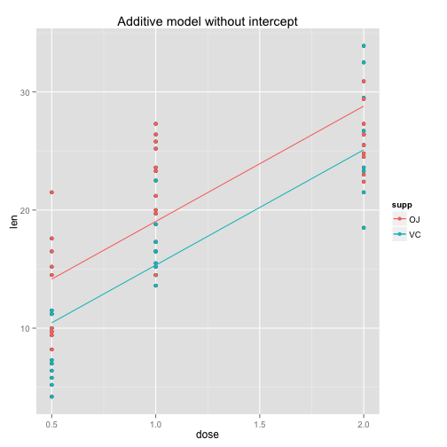 

```r
#plot with lines from interactive model with intercept
grid$len <- stats::predict(mod.int, newdata=grid)
ggplot(data = ToothGrowth, aes(x=dose, y=len)) + geom_point() + geom_point(aes(colour=supp)) + geom_line(data= filter(grid, supp == "OJ"), aes(color = supp))+ geom_line(data= filter(grid, supp == "VC"), aes(color = supp)) + ggtitle("Interactive model with intercept")
```

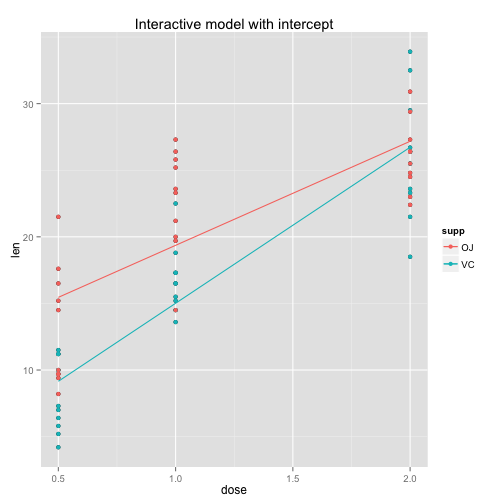 

```r
#plot with lines from interactive model without intercept
grid$len <- stats::predict(mod.int.0, newdata=grid)
ggplot(data = ToothGrowth, aes(x=dose, y=len)) + geom_point() + geom_point(aes(colour=supp)) + geom_line(data= filter(grid, supp == "OJ"), aes(color = supp))+ geom_line(data= filter(grid, supp == "VC"), aes(color = supp)) + ggtitle("Interactive model without intercept")
```

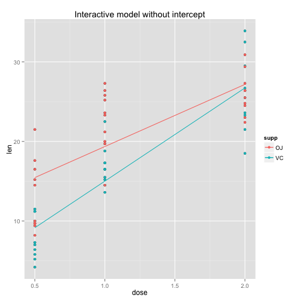 
This forces the intercept to be 0. 

Thought question: Take a moment to interpret the coefficients of the model. 
Q1 - What are the units?
teeeeth growth
Q2 - How does the interaction relate to the plot?
if there were an interaction, the slope of the line would be different for OJ than for VC.  looks pretty subtle in teh plot, can't really see it.
Q3 - Should there be an interaction in the model? What does it mean? How important is it?  
ehhhh, not sure.  it would mean that the effect of dose on tooth growth is different depending on the delivery method.  

Now make predictions from the model you like the best. What should happen with
doses of 0, 1.5, 2.5, and 10 under both supplements? 

HINT: use the `predict` function ...

HINT 2: you will have to make a dataframe to do the prediction with, so use something like `data.frame(dose=...)`.


```r
preds.oj = data.frame(dose = c(0, 1.5, 2.5, 10), supp ="OJ")
preds.vc = data.frame(dose = c(0, 1.5, 2.5, 10), supp ="VC")
cat("Predictions using interactive model with intercept for OJ at doses of 0, 1.5, 2.5, 10: ", predict(mod.int, newdata = preds.oj))
```

```
## Predictions using interactive model with intercept for OJ at doses of 0, 1.5, 2.5, 10:  11.55 23.26714 31.07857 89.66429
```

```r
cat("Predictions using interactive model with intercept for VC at doses of 0, 1.5, 2.5, 10: ", predict(mod.int, newdata = preds.vc))
```

```
## Predictions using interactive model with intercept for VC at doses of 0, 1.5, 2.5, 10:  3.295 20.86857 32.58429 120.4521
```
I wouldn't really want to predict out to a dose of 10, as there is no reason to believe that tooth growth would continue at a linear rate all the way up to such a high dosage.

Now plot the residuals from the original model. How do they look?
HINT: `?resid`


```r
plot(mod.main, which = 1)
```

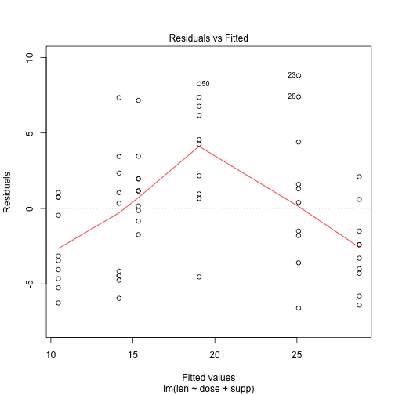 

```r
plot(mod.int, which = 1)
```

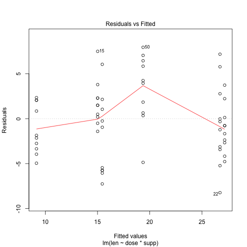 

```r
qplot(residuals(mod.int), fitted(mod.int))
```

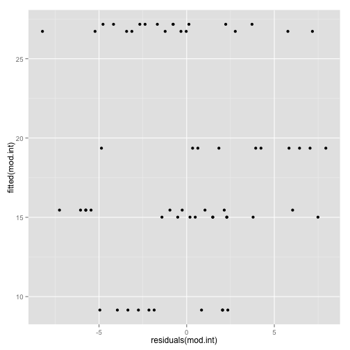 

```r
#with(ToothGrowth, qplot(residuals(mod.int), fitted(mod.int), facets = .~supp))

fmod = fortify(mod.int)
#fmod$len <- stats::predict(mod.main, newdata=grid)

qplot(.fitted, .resid, data = fmod) +
  geom_hline(yintercept = 0) + geom_smooth(se=FALSE)
```

```
## geom_smooth: method="auto" and size of largest group is <1000, so using loess. Use 'method = x' to change the smoothing method.
```

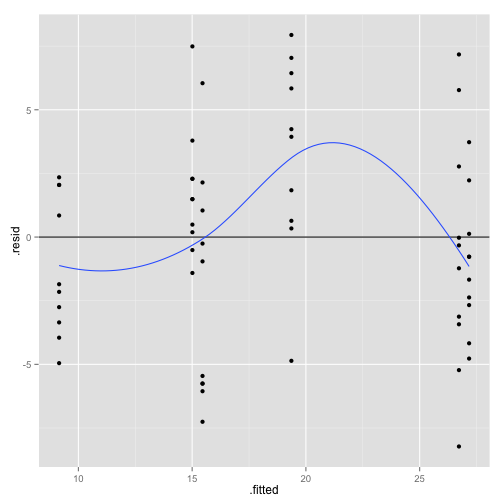 

```r
#qplot(.fitted, .stdresid, data = fmod) +
#  geom_hline(yintercept = 0) + geom_smooth(se=FALSE)
```
They don't look super hot, there's a clear pattern in the residuals, indicating that perhaps the linear model is not the best fit for these data. Bummer.


BONUS: test them for normality of distribution using a quantile-quantile plot.

HINT: `?qqplot` and `?qqnorm`


```r
plot(mod.int, which = 2)
```

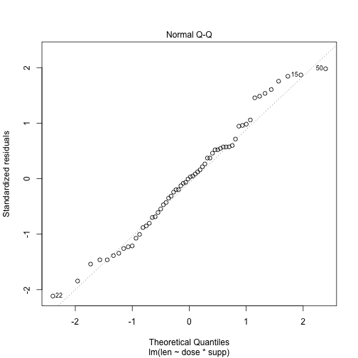 

```r
qqnorm(residuals(mod.int))
```

 

```r
#qqplot(residuals(mod.main))
```
Well those at least look pretty good

2B: Exploratory Linear Modeling
-------------------------------

What the heck is going on? Load data from Frank, Vul, Saxe (2011, Infancy), a study in which we measured infants' looking to hands in moving scenes. There were infants from 3 months all the way to about two years, and there were two movie conditions (`Faces_Medium`, in which kids played on a white background, and `Faces_Plus`, in which the backgrounds were more complex and the people in the videos were both kids and adults). Forgive our bad naming conventions.

Try to figure out what the most reasonable linear model of the data is.


```r
d <- read.csv("../data/FVS2011-hands.csv")

qplot(age, hand.look, facets = .~ condition, data = d)
```

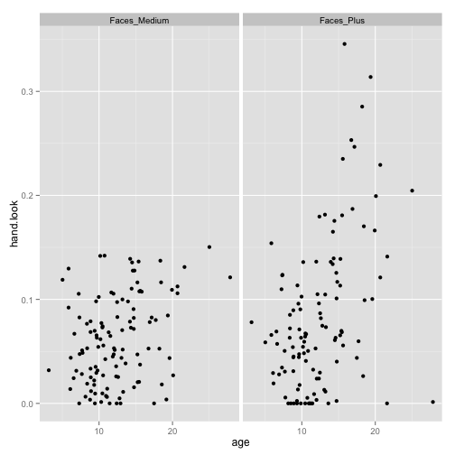 

```r
qplot(age, hand.look, colour = condition, data = d)
```

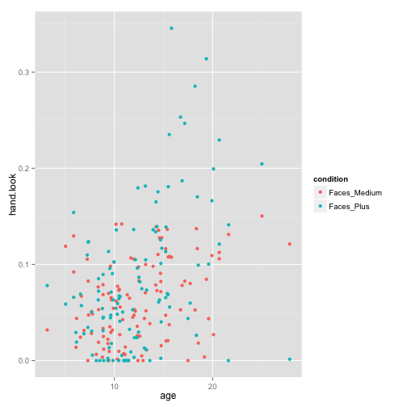 

```r
mod1 = with(d, lm(hand.look ~ age + condition))
summary(mod1)
```

```
## 
## Call:
## lm(formula = hand.look ~ age + condition)
## 
## Residuals:
##       Min        1Q    Median        3Q       Max 
## -0.159908 -0.035120 -0.006159  0.028734  0.246199 
## 
## Coefficients:
##                       Estimate Std. Error t value Pr(>|t|)    
## (Intercept)         -0.0023491  0.0115374  -0.204  0.83884    
## age                  0.0051414  0.0008351   6.156  3.3e-09 ***
## conditionFaces_Plus  0.0204451  0.0072375   2.825  0.00515 ** 
## ---
## Signif. codes:  0 '***' 0.001 '**' 0.01 '*' 0.05 '.' 0.1 ' ' 1
## 
## Residual standard error: 0.05512 on 229 degrees of freedom
## Multiple R-squared:  0.1667,	Adjusted R-squared:  0.1595 
## F-statistic: 22.91 on 2 and 229 DF,  p-value: 8.488e-10
```

```r
mod2 = with(d, lm(hand.look ~ age*condition))
summary(mod2)
```

```
## 
## Call:
## lm(formula = hand.look ~ age * condition)
## 
## Residuals:
##       Min        1Q    Median        3Q       Max 
## -0.190121 -0.036508 -0.001239  0.032091  0.239474 
## 
## Coefficients:
##                          Estimate Std. Error t value Pr(>|t|)   
## (Intercept)              0.022394   0.015417   1.453  0.14772   
## age                      0.003143   0.001176   2.673  0.00807 **
## conditionFaces_Plus     -0.028440   0.021680  -1.312  0.19089   
## age:conditionFaces_Plus  0.003950   0.001653   2.389  0.01770 * 
## ---
## Signif. codes:  0 '***' 0.001 '**' 0.01 '*' 0.05 '.' 0.1 ' ' 1
## 
## Residual standard error: 0.05456 on 228 degrees of freedom
## Multiple R-squared:  0.1871,	Adjusted R-squared:  0.1764 
## F-statistic: 17.49 on 3 and 228 DF,  p-value: 2.955e-10
```

```r
anova(mod1, mod2)
```

```
## Analysis of Variance Table
## 
## Model 1: hand.look ~ age + condition
## Model 2: hand.look ~ age * condition
##   Res.Df     RSS Df Sum of Sq      F Pr(>F)  
## 1    229 0.69573                             
## 2    228 0.67874  1  0.016992 5.7079 0.0177 *
## ---
## Signif. codes:  0 '***' 0.001 '**' 0.01 '*' 0.05 '.' 0.1 ' ' 1
```

Plot that model on the same plot as the data.

HINT: you can do this either using `predict` or (if you are feeling confident of your understanding of the models) using the built-in linear models in `ggplot`'s `geom_smooth`. 


```r
dat <- with(d, expand.grid(
  condition = levels(condition), age = as.numeric(levels(factor(age)))
))

#plot with lines from the interactive
dat$hand.look <- stats::predict(mod2, newdata=dat)
ggplot(data = d, aes(x=age, y=hand.look)) + geom_point() + geom_point(aes(colour=condition)) + geom_line(data= filter(dat, condition == "Faces_Medium"), aes(color = condition))+ geom_line(data= filter(dat, condition == "Faces_Plus"), aes(color = condition)) + ggtitle("Interactive model")
```

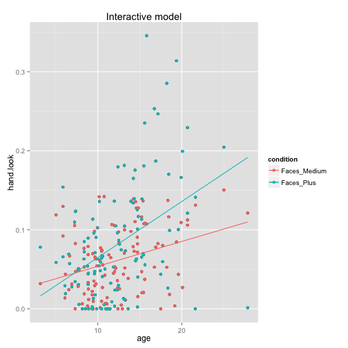 

What do you conclude from this pattern of data?

Greater age predicts longer hand look times.  The effect of age on hand look times is stronger when the scenes are more complex.
